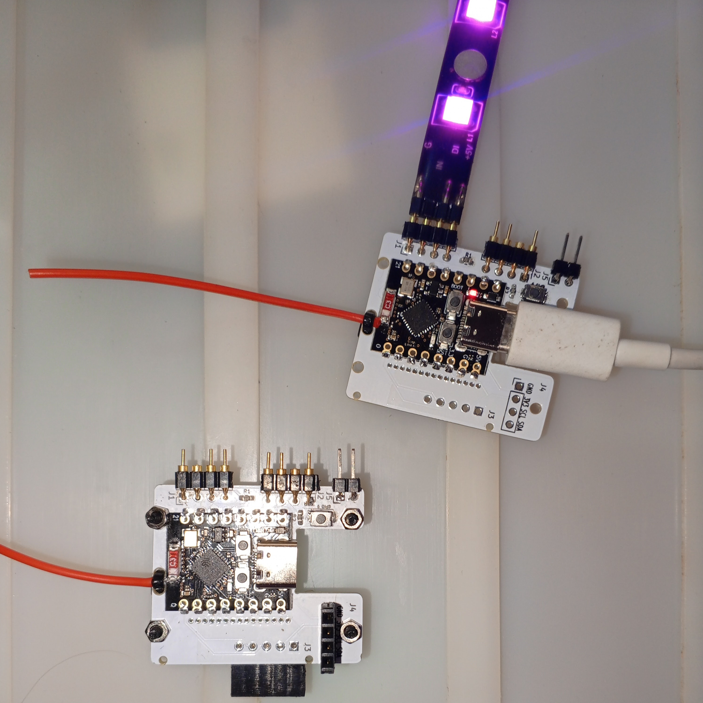

# WLED Shield V2

Placa controladora para LEDs direccionables de 5V, características avanzadas con conectividad wi-fi. 

## La placa
 
 

    
    
Vista superior

  

    
    
Vista Trasera

  

  

    
    
Versión Full

  

-	Conectividad directa de 2 tiras led con patrones de iluminación independientes, programables y configurables.

-	Software WLED traducido por nosotros al español y pre-configurado para la placa.

-	Alimentación de 5V DC via USB tipo C con un cargador de teléfono o mediante cable SATA de 15 pines (opcional para colocar en una PC gaming).

-	2 salidas o segmentos independientes para tiras de 5 V para controlar LEDs NeoPixel (WS2812B, WS2811, SK6812). Fan coolers RGB direccionales. Etc.

-	2 botones configurables desde la interfaz: 
    *	1 botón sobre la placa: SW1 (GPIO9)
    *	1 botón opcional externo mediante el conector J5 (GPIO9).  
-	El software incluido incluye 3 mods instalados y preconfigurados para la placa:  
    *	Autosave que guarda el último estado de la configuración.
    *	Display de 4 líneas para conectar opcionalmente un display en el conector J4. El display debe contar con protocolo I2C.
    *	Encoder incremental opcional para conectar en J3.  
## WLED  
 

    
    
Menú principal en PC

WLED es el software que utiliza la placa, la página oficial de los desarrolladores y la que ofrece la mayor documentación es la siguiente: [https://kno.wled.ge](https://kno.wled.ge).

### Características
 
*	Biblioteca WS2812FX integrada con más de 100 efectos especiales.
*	Efectos FastLED y 50 paletas de colores.
*	Interfaz web moderna con controles de color, efectos y segmentos.
*	Segmentos: permite configurar diferentes efectos y colores en distintas partes de los LEDs.
*	Página de configuración: ajustes accesibles a través de la red.
*	Modo punto de acceso (AP) y estación: incluye AP de respaldo automático.
*	Hasta 3 salidas LED por instancia de ESP8266 y 10 salidas LED por instancia de ESP32. (nuestra placa al ser reducida tiene 2 salidas físicas, sin embargo se pueden obtener más ya que presenta accesibilidad a todos los pines).
*	Soporte para tiras LED RGBW.
*	Hasta 250 presets de usuario para guardar y cargar colores/efectos fácilmente, con soporte para ciclos automáticos.
*	Los presets pueden ejecutar llamadas API automáticamente.
*	Función de luz nocturna (se atenúa gradualmente).
*	Actualización completa de software por OTA (HTTP + ArduinoOTA), con opción de protección por contraseña.
*	Límite de brillo automático configurable para un funcionamiento más seguro.
*	Configuración basada en sistema de archivos para facilitar el respaldo de presets y configuraciones.
*	Integración nativa con Home Assistant: inicia la configuración de integración nativa.

### Comunicación
-	Aplicaciones móviles desarrolladas por la comunidad:
-	Aplicación nativa de WLED creada por Moustachauve:
-	Para Android [Fuente]
-	Para iOS [Fuente]
-	APIs de solicitudes JSON y HTTP.
-	MQTT.
-	Blynk IoT.
-	E1.31, Art-Net, DDP y TPM2.net.
-	Hyperion.
-	Realtime UDP.
-	Control por voz con Alexa (incluye ajuste de brillo y color).
-	Sincronización con luces Philips Hue.
-	Adalight (Ambilight para PC vía serial) y TPM2.
-	Sincronización del color entre múltiples dispositivos WLED (notificador UDP).
-	Mandos infrarrojos (requiere receptor y mando RGB de 24 teclas).
-	Temporizadores simples/programación (hora desde NTP, soporta zonas horarias/DST).

## Primera conexión

Alimentar la placa con un cable para teléfono USB tipo C y un cargador de teléfono. El led rojo se ha de iluminar.

Desde un teléfono celular conectarse a la red WIFI llamada WLED-AP.  Desde allí debe aparecer la página de configuración, en caso de conectarse desde un PC, colocar en el navegador la IP del punto de acceso: 4.3.2.1

Es recomendable pero opcional configurar la red local wifi, añadiendo SSID y password de la red local. Luego de realizado el controlador se reinicia y se conecta a la red local si la señal es suficientemente fuerte, si no puede conectarse entrara de nuevo en modo AP (punto de acceso).

  

     
  

  

    
  

## Galería

  

     
  

  

    
  

  

    
  

  

    
  

## Screenshots (capturas de pantalla)

    
    
Menú principal en PC

  

    
    
"Ajustes" en móvil

  

  

    
    
Pestaña "Información"

  

